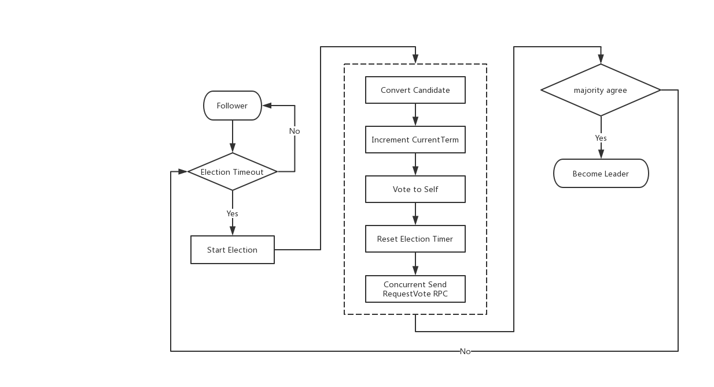

# Lab2 PartA 部分实现笔记

**Part 2A** 要求实现leader选举（leader election）和心跳（heartbeats），不用实现日志复制。

## 重要的接口

```go
// create a new Raft server instance:
rf := Make(peers, me, persister, applyCh)

// start agreement on a new log entry:
rf.Start(command interface{}) (index, term, isleader)

// ask a Raft for its current term, and whether it thinks it is leader
rf.GetState() (term, isLeader)

// each time a new entry is committed to the log, each Raft peer
// should send an ApplyMsg to the service (or tester).
type ApplyMsg
```

Lab2 要求实现上述的接口，最终的测试用例会调用上面的接口检测你的程序, 下面将详细的描述这几个接口的作用和目的，不过在Part 2A部分中，我们只需要实现下面这几个接口:

- Make
- rf.Start
- rf.GetState()

了解了Part 2A的需求后，就可以动手实现了。在实现前一定需要仔细阅读Figure 2，确保能够精确的理解Figure 2的意思。

对于Figure 2中不理解的，需要仔细阅读论文中对其相关的描述。

## Leader 选举

Leader选举是我们开始Raft算法的第一步，因此在实现此部分的功能前需要根据论文中的描述填充`raft.go`中的几个重要的数据结构

### Raft struct

根据论文中的Figure 2表述，所有的服务器都会存在两类状态，**Persistent State** 和 `Volatile State`. 因为我们可以将这两类状态对应的字段定义到Raft进去


首先我们先来看进行一次leader选举的过程，如图：



